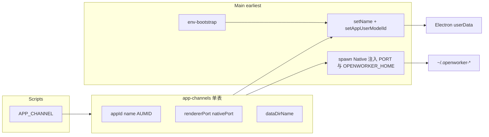

# Electron 渠道化双应用与存储隔离

## Status

COMPLETED

## Priority

P1

## Dependencies

- None

## Decision Needed

- None

## Context

同一套 Electron 代码需支持 Dev 开发与 Test 安装包并存，身份与数据互不影响。参考「完整双应用」模型（非 `--user-data-dir` 单参数、非 beta 更新通道）。

## Goal

按 dev / test / prod 三渠道隔离 appId、产品名、userData、Native 端口与 `OPENWORKER_HOME`，使 `pnpm desktop:dev` 与已安装的 OpenWorker Test 可同时运行。

## Scope

### In Scope

- 渠道表一处维护（appId、显示名、端口、数据根）
- 主进程最早 `setName` / `setAppUserModelId`；env → identity 顺序
- electron-vite `strictPort`、`__APP_CHANNEL__`；electron-builder 多身份
- Native `OPENWORKER_HOME` 与 spawn 端口注入
- `.env.example` / README 更新

### Out of Scope

- 自定义协议、自动更新 feed、钥匙串 service name
- `dev:test` 未打包脚本

## Requirements

- dev / test / prod 各有一套 appId、Native 口、数据根
- 未打包固定 dev；打包身份由 `__APP_CHANNEL__` 冻结
- Test 与 Prod 不同 appId，避免安装覆盖
- Native 默认端口 3200 / 3201 / 3202

## Constraints

- 遵循 `.agents/AGENTS.md`（pnpm、Conventional Commits）
- `scripts/app-channels.mjs` 与 `src/shared/app-channels-data.ts` 需手动同步

## Acceptance Criteria

- [x] `pnpm desktop:dev` 与已安装 Test 可同时打开，userData / Native / 数据根互不覆盖
- [x] `pnpm desktop:build:test` → appId `com.openworker.desktop.test`
- [x] `pnpm desktop:build` → appId `com.openworker.desktop`，Native 3202
- [x] 占用 5173 时 dev 失败（strictPort）
- [x] `pnpm typecheck` / `pnpm lint` 通过

## Related Decisions

- None

---

## Plan（归档自 Cursor Plan「Electron 渠道双应用」）

依据归档结论：目标是**完整双应用**。日常：**开发跑 Dev（未安装）**，**本机测试装 Test（安装包）**；Dev 进程与 Test 安装版可同时开，身份与数据互不影响。

### 渠道约定（定死）

| Channel | 显示名          | appId                         | 渲染口          | Native 口              | 数据根               | 场景                               |
| ------- | --------------- | ----------------------------- | --------------- | ---------------------- | -------------------- | ---------------------------------- |
| `dev`   | OpenWorker Dev  | `com.openworker.desktop.dev`  | 5173            | 3200                   | `~/.openworker-dev`  | `pnpm desktop:dev`                 |
| `test`  | OpenWorker Test | `com.openworker.desktop.test` | 5174            | 3201                   | `~/.openworker-test` | `pnpm desktop:build:test` 安装使用 |
| `prod`  | OpenWorker      | `com.openworker.desktop`      | （打包无 Vite） | 3202（仅本进程 spawn） | `~/.openworker`      | `pnpm desktop:build`，身份冻结     |

未设置 `APP_CHANNEL` 时：未打包默认 `dev`，已打包默认 `prod`。

### appId 与运行时身份

- Test 与 Prod 必须用不同 `appId`，避免 Windows 安装覆盖
- Dev 未打包靠 `setName` / `AppUserModelId` + 独立 userData
- `appUserModelId` 与 `appId` 对齐

### Dev 与 Test 隔离

| 隔离层            | Dev               | Test（安装包）     |
| ----------------- | ----------------- | ------------------ |
| Electron userData | OpenWorker Dev    | OpenWorker Test    |
| Native 数据       | ~/.openworker-dev | ~/.openworker-test |
| Native API 口     | 3200              | 3201               |
| 渲染              | Vite 5173         | 打包静态页         |

边界：同一工作区目录下 `.openworker/plans/` 为工作区本地数据，Dev/Test 打开同一文件夹会共享。

### 架构

### 实现步骤（计划）

1. 渠道表：`app-channels-data.ts` / `app-channels.ts` / `scripts/app-channels.mjs`
2. 主进程：env-bootstrap → app-identity
3. 构建：electron.vite.config、`electron-builder.config.mjs`、scripts
4. Native：`OPENWORKER_HOME`、`native-service` spawn 注入
5. 文档：`.env.example`、README

## Completion

### Implementation

- 新增 `apps/desktop/src/shared/app-channels-data.ts`、`app-channels.ts`、`app-channels.types.ts`
- 新增 `apps/desktop/scripts/app-channels.mjs`、`electron-builder.config.mjs`
- 更新 `app-identity.ts`、`index.ts` import 顺序、`native-service.ts`
- 更新 `electron.vite.config.ts`（strictPort、`__APP_CHANNEL__`、渠道 Native URL）
- 更新 `package.json` scripts：`dev` / `build` / `build:test`；根目录 `desktop:build:test`
- Native：`paths.ts`、`config/env.ts` 支持 `OPENWORKER_HOME`

### Tests

- 未新增自动化测试

### Validation

- `pnpm --filter @openworker/desktop typecheck` 通过
- `pnpm --filter @openworker/native typecheck` 通过
- `pnpm lint` 通过

### Notes

- Git: `c20153d` feat(desktop): 引入 Dev/Test/Prod 发行渠道，隔离端口与数据根
- Health 复用按各渠道 baseUrl（端口不同）自然隔离；手动改 `.env` 仍可能串数据
