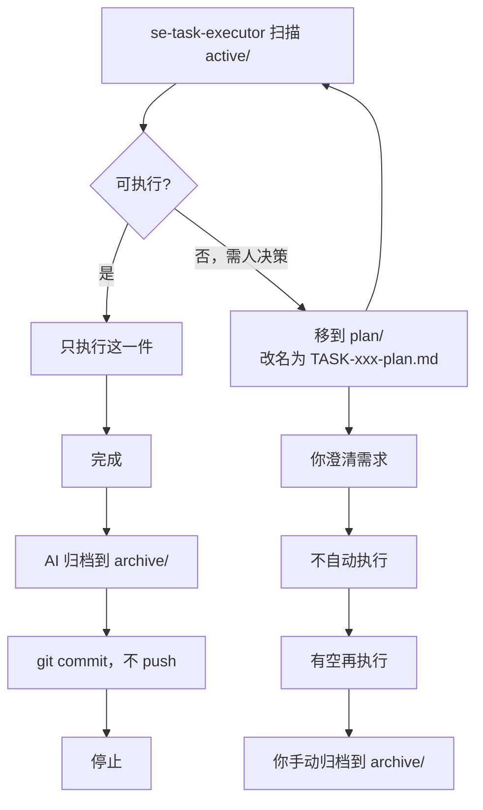

# 目录说明

```text
.ai/
├── task-template.md       ← 模板，不动
├── decision-template.md   ← 模板，不动
│
├── tasks/
│   ├── active/            ← AI 当前可以直接执行的任务
│   ├── plan/              ← 需要人决策 / 澄清，由人处理
│   ├── blocked/           ← 执行过程中被外部条件阻塞
│   └── archive/           ← AI 归档 active 完成任务；plan 完成后由人归档
│       └── 年份/
│
└── decisions/             ← 已确认的架构决策
```

# decisions

- 文件名：`ADR-<英文短名>.md`，如 `ADR-module-map.md`
- AI 可以阅读但不可以修改、创建、删除 Decision
- AI 可以提出新的 Decision，但不应该擅自修改已有 Decision

# tasks

- 任务名称优先使用中文，如：实现用户登录
- 只有当前任务需要历史上下文时，才读取 archive/

# 执行任务流程


